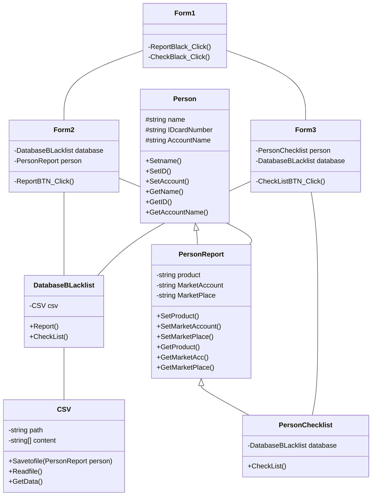

### ความเป็นมาของโปรแกรม
ได้รับแรงบันดาลใจมาจากเว็บไซต์ https://www.blacklistseller.com/ 

### วัตถุประสงค์ของโปรแกรม
เป็นโปรแกรมสำหรับบันทึกข้อมูลของผู้ขายที่ถูกแบล็คลิสต์ให้ผู้ซื้อได้มาตรวจสอบ ก่อนจะทำการซื้อขายใดๆกับผู้ที่คาดว่าน่าจะถูกแบล็คลิสต์

### โครงสร้างของโปรแกรม

ผู้พัฒนาโปรแกรม
นาย จตุภัทร อนุเดชากุล รหัสนักศึกษา 663450035-5